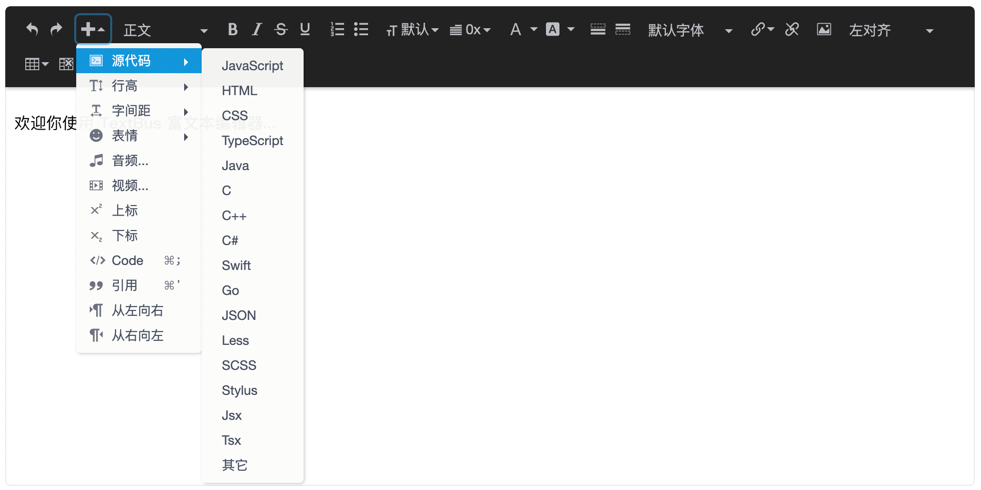

Textbus
================================

> 如果你还在使用 1.0 版本，源代码请访问 [Textbus 1.*](https://github.com/textbus/textbus-1.0)

Textbus 是一个组件化、跨平台、数据驱动的富文本框架，并坚定的支持在线协同。使用 Textbus 你可以轻松创建你自完全自定义的编辑器。

我们一直致力于让富文本开发也能像普通前端框架一样，通过简明易懂的 api 和少量的约定，即可扩展出健壮的、符合预期的富文本编辑器。在 Textbus 1.0 的时，我们为此做了非常多的探索和努力，取得了不错的成果，但也因为如此，1.0 的设计在某些方面还留下一些遗憾。

幸运的是，Textbus 2.0 已经到来，我们在 1.0 的成果之上，重新设计了整个架构，致力于更简洁的 api，更友好的开发接入方式。

+ 重新设计了组件系统，去掉了大家难以理解的装饰器，改为用类似 vue 的 setup 形式开发组件，并提供了一系列的 hooks 供大家定制交互行为
+ 重新设计了数据模型，可根据用户的操作生成特定的底层原子命令，这让细粒度的历史记录和文档协同成为可能
+ 核心架构脱离了具体平台，让 Textbus 的能力不仅限于在 PC 端，通过编写特定的中间层，可以方便的在移动端，甚至小程序上实现丰富的富文本能力
+ 重写了渲染层，现在 Textbus 2.0 大多数情况下更新视图仅需要 0.2ms 时间，比 1.0 性能更好



## 安装

Textbus 可能通过两种方式引入到你的项目中。

### 通过 npm 安装
```
npm install @textbus/core @textbus/browser @textbus/editor
```
在 DOM 中准备好一个空的标签
```html
<div id="editor"></div>
```

创建编辑器实例

```ts
import '@textbus/editor/bundles/textbus.min.css';
import { createEditor } from '@textbus/editor';

const editor = createEditor()
editor.mount(document.getElementById('editor'))
```


### 通过 script 标签引入

```html
<!DOCTYPE html>
<html>
<head>
  <link rel="stylesheet" href="/path/textbus.min.css">
  <script src="/path/textbus.min.js"></script>
  <title>Textbus 示例</title>
</head>
<body>
<div id="editor"></div>
<script>
  var editor = textbus.editor.createEditor()
  editor.mount(document.getElementById('editor'))
</script>
</body>
</html>
```
## 官方文档

[Textbus 官方文档](https://Textbus.io)

## 本地开发

Textbus 采用 lerna 作为多模块管理，全局安装 lerna。

```
npm install lerna -g
```

克隆 Textbus 仓库，并安装依赖。

```
git clone git@github.com:textbus/textbus.git
cd textbus
lerna bootstrap --hoist
```

启动开发环境。

```
npm start
```

## 联系我们

如果在官网还不能找到你想了解的问题，你可以加入 Textbus 的官方 QQ 群：786923770。你也可以直接扫码加入：


## 赞助

Textbus 的成长离不开社会的支持，如果 Textbus 为你带来了帮助，并且你也认同为知识付费，同时鼓励我们做的更好，欢迎通过下面的二维码表达你的支持

 
